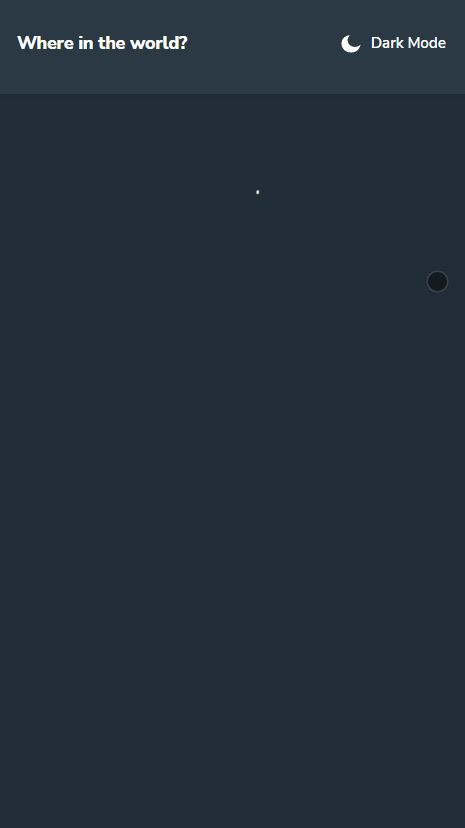

# Marcin Augun - Where in the world?

## Description

This time I have created Where in the worls website based on one of the numerous challenges of [Frontend Mentor](https://www.frontendmentor.io/home).

Be sure to check out the demo for a firsthand look at this excellent tool for locating and learning about a particular country.

## Check out the [Demo](https://marcin10lw.github.io/rest-countries-react/#/countries) 👈

As always this was an excellent learning opportunity in which I could improve making responsive websites using [React](https://legacy.reactjs.org/) and [React Router](https://reactrouter.com/en/main) and working with API using Redux Toolkit, Redux-saga.

## Technologies used

    ✔ React
    ✔ TypeScript
    ✔ Redux Toolkit
    ✔ Redux-saga
    ✔ React Router
    ✔ Create-react-app
    ✔ Webpack
    ✔ Babel
    ✔ Styled Components
    ✔ Normalize
    ✔ ES6+ Features
    ✔ Framer Motion

## Stand out! Features added independently:

    ✔ Pagination view
    ✔ Pagination logic
    ✔ Theme toggler and regions selector animations

## Page preview

### Desktop preview

### Mobile preview

This project was bootstrapped with [Create React App](https://github.com/facebook/create-react-app).

## Available Scripts

In the project directory, you can run:

### `npm start`

Runs the app in the development mode.\
Open [http://localhost:3000](http://localhost:3000) to view it in your browser.

The page will reload when you make changes.\
You may also see any lint errors in the console.

### `npm run build`

Builds the app for production to the `build` folder.\
It correctly bundles React in production mode and optimizes the build for the best performance.

The build is minified and the filenames include the hashes.\
Your app is ready to be deployed!

See the section about [deployment](https://facebook.github.io/create-react-app/docs/deployment) for more information.

### `npm run eject`

**Note: this is a one-way operation. Once you `eject`, you can't go back!**

If you aren't satisfied with the build tool and configuration choices, you can `eject` at any time. This command will remove the single build dependency from your project.

Instead, it will copy all the configuration files and the transitive dependencies (webpack, Babel, ESLint, etc) right into your project so you have full control over them. All of the commands except `eject` will still work, but they will point to the copied scripts so you can tweak them. At this point you're on your own.

You don't have to ever use `eject`. The curated feature set is suitable for small and middle deployments, and you shouldn't feel obligated to use this feature. However we understand that this tool wouldn't be useful if you couldn't customize it when you are ready for it.
